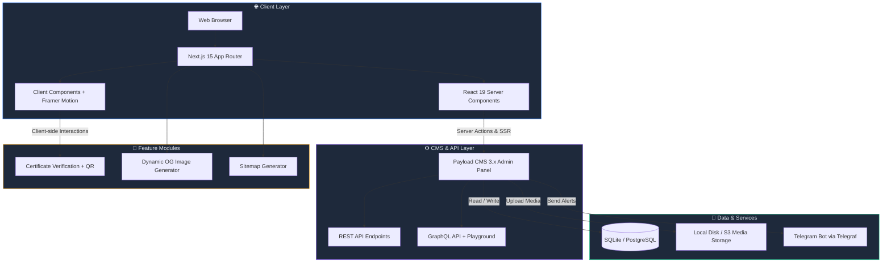

<div align="center">

  <!-- Animated Gradient Banner -->
  <picture>
    <source media="(prefers-color-scheme: dark)" srcset="https://capsule-render.vercel.app/api?type=waving&color=0:0f172a,50:1e40af,100:7c3aed&height=220&section=header&text=⚡%20Coding%20Club%20CUH&fontSize=42&fontColor=ffffff&animation=fadeIn&fontAlignY=35&desc=For%20Students%2C%20By%20Students&descSize=16&descAlignY=55&descColor=94a3b8" />
    <source media="(prefers-color-scheme: light)" srcset="https://capsule-render.vercel.app/api?type=waving&color=0:1e3a8a,50:2563eb,100:7c3aed&height=220&section=header&text=⚡%20Coding%20Club%20CUH&fontSize=42&fontColor=ffffff&animation=fadeIn&fontAlignY=35&desc=For%20Students%2C%20By%20Students&descSize=16&descAlignY=55&descColor=e2e8f0" />
    
  </picture>

  <br/>

  

  <br/><br/>

  **The official digital ecosystem powering the Coding Club at Central University of Haryana.**
  <br/>
  *Built with modern web technologies. Managed entirely by admins via a headless CMS.*

  <br/>

  <!-- Dynamic GitHub Badges -->
  <p>
    <a href="https://github.com/itsmeaj27/codingclub/stargazers"></a>
    <a href="https://github.com/itsmeaj27/codingclub/network/members"></a>
    <a href="https://github.com/itsmeaj27/codingclub/issues"></a>
    <a href="https://github.com/itsmeaj27/codingclub/pulls"></a>
    <a href="https://github.com/itsmeaj27/codingclub/blob/main/LICENSE"></a>
  </p>

  <!-- Tech Stack Pill Badges -->
  <p>
    
    
    
    
    
    
    
    
  </p>

  <!-- Quick Navigation -->
  <p>
    <a href="#-highlights"><b>Highlights</b></a>&nbsp;&nbsp;·&nbsp;&nbsp;
    <a href="#-features"><b>Features</b></a>&nbsp;&nbsp;·&nbsp;&nbsp;
    <a href="#%EF%B8%8F-architecture"><b>Architecture</b></a>&nbsp;&nbsp;·&nbsp;&nbsp;
    <a href="#-quick-start"><b>Quick Start</b></a>&nbsp;&nbsp;·&nbsp;&nbsp;
    <a href="#-admin-cms-guide"><b>Admin Guide</b></a>&nbsp;&nbsp;·&nbsp;&nbsp;
    <a href="#-project-structure"><b>Structure</b></a>&nbsp;&nbsp;·&nbsp;&nbsp;
    <a href="#-contributing"><b>Contributing</b></a>
  </p>

</div>

<br/>

<!-- ═══════════════════════════════════════════════════════════ -->

## 🔥 Highlights

<div align="center">

<table>
<tr>
<td align="center" width="25%">
<br/>

<br/><br/>
<b>Next.js 15</b>
<br/>
<sub>App Router · SSR · RSC</sub>
<br/><br/>
</td>
<td align="center" width="25%">
<br/>

<br/><br/>
<b>React 19</b>
<br/>
<sub>Server Components · Hooks</sub>
<br/><br/>
</td>
<td align="center" width="25%">
<br/>

<br/><br/>
<b>TypeScript 5</b>
<br/>
<sub>End-to-End Type Safety</sub>
<br/><br/>
</td>
<td align="center" width="25%">
<br/>

<br/><br/>
<b>Payload CMS 3</b>
<br/>
<sub>Headless · Admin Panel</sub>
<br/><br/>
</td>
</tr>
</table>

</div>

<br/>

<!-- ═══════════════════════════════════════════════════════════ -->

## ✨ Features

<table>
<tr>
<td width="50%" valign="top">

### 🛡️ Certificate Verification Engine
Verify issued club certificates in real-time via `/verify/:id` routes.
QR code generation, cryptographic validation, and instant **client-side PDF export** with jsPDF & html2canvas.

</td>
<td width="50%" valign="top">

### ⚡ Headless CMS — Admin Controlled
Full-featured **Payload CMS 3.x** with Lexical rich-text editor, live multi-device preview, and 12+ content collections — all managed by club admins without touching code.

</td>
</tr>
<tr>
<td width="50%" valign="top">

### 📅 Dynamic Events & Workshops
Timeline-driven events page auto-populated from the CMS.  
Cover photos, registration links, status badges (*Upcoming / Ongoing / Completed*), and location metadata — all uploaded by admins.

</td>
<td width="50%" valign="top">

### 🚀 Student Project Showcase
Curated portfolio of student open-source contributions and achievements.  
Each project card includes tech stack, live demo links, GitHub URLs, and screenshots — all admin-managed.

</td>
</tr>
<tr>
<td width="50%" valign="top">

### 🤖 Telegram Bot Alerts
Automated notifications via **Telegraf** pushing event announcements, new registrations, and form submissions directly to the club's Telegram channel.

</td>
<td width="50%" valign="top">

### 🎨 Fluid Motion & Theming
Seamless **Dark/Light mode** with `next-themes`.  
Silky micro-interactions via **Framer Motion** and **Magic UI** — animated sliders, border beams, text effects, and parallax sections.

</td>
</tr>
<tr>
<td width="50%" valign="top">

### 📸 Gallery & Media Management
Dynamic photo gallery with categorized uploads (*Events, Workshops, Team Photos, Activities*).  
All images uploaded via Admin Dashboard, served with Sharp optimization.

</td>
<td width="50%" valign="top">

### 🌐 SEO & Social Cards
Auto-generated sitemaps via `next-sitemap`.  
Dynamic **OpenGraph images** generated at `/og-image/[text]` for every page and post — ensuring rich link previews on Twitter, LinkedIn, and WhatsApp.

</td>
</tr>
</table>

<br/>

<!-- ═══════════════════════════════════════════════════════════ -->

## 🏗️ Architecture



<br/>

<!-- ═══════════════════════════════════════════════════════════ -->

## 🚀 Quick Start

### 📋 Prerequisites

| Tool | Version | Purpose |
| :--- | :--- | :--- |
| **Node.js** | `>= 20.0.0` | JavaScript runtime |
| **pnpm** | `>= 10.x` | Fast, disk-efficient package manager |

### 🛠️ Installation

```bash
# 1️⃣  Clone the repository
git clone https://github.com/itsmeaj27/codingclub.git
cd codingclub

# 2️⃣  Install dependencies
pnpm install

# 3️⃣  Configure environment
cp .env.example .env

# 4️⃣  Generate Payload CMS types
pnpm run generate

# 5️⃣  Launch development server
pnpm dev
```

### 🔐 Environment Variables

| Variable | Required | Description |
| :--- | :---: | :--- |
| `DATABASE_URI` | ✅ | Database connection string (`file:payload.db` for local SQLite) |
| `PAYLOAD_SECRET` | ✅ | Secret key for auth encryption & session tokens |
| `NEXT_PUBLIC_SERVER_URL` | ✅ | Base URL for the app (default: `http://localhost:3001`) |
| `TELEGRAM_BOT_TOKEN` | ➖ | Telegram bot token for automated alerts |
| `TELEGRAM_CHAT_ID` | ➖ | Target Telegram channel/group ID |

> [!TIP]
> 🔑 Access the **Admin Panel** at [`localhost:3001/admin`](http://localhost:3001/admin) — create the first superadmin account on initial launch.

<br/>

<!-- ═══════════════════════════════════════════════════════════ -->

## 🎛️ Admin CMS Guide

> **Everything on this platform is managed dynamically by admins through the Payload CMS Dashboard.**
> No code changes required — just log in, create content, upload media, and publish.

<table>
<tr>
<th width="5%">🔢</th>
<th width="20%">CMS Collection</th>
<th width="35%">What Admins Manage</th>
<th width="40%">Fields & Uploads</th>
</tr>
<tr>
<td align="center">1</td>
<td><b>👥 Teams</b></td>
<td>Faculty coordinators, core team, technical leads, design & media crew</td>
<td>Name, Position, Category, Course & Year, <b>Profile Photo</b>, LinkedIn, GitHub</td>
</tr>
<tr>
<td align="center">2</td>
<td><b>📅 Events</b></td>
<td>Hackathons, workshops, bootcamps, seminars</td>
<td>Title, Date, Location, Status, Description, <b>Cover Poster</b>, Gallery Photos, Registration Link</td>
</tr>
<tr>
<td align="center">3</td>
<td><b>📸 Gallery</b></td>
<td>Group photos, campus shots, workshop captures</td>
<td><b>Image Upload</b>, Caption, Category (<i>Events, Workshops, Team, Activities</i>)</td>
</tr>
<tr>
<td align="center">4</td>
<td><b>🎓 Certificates</b></td>
<td>Verifiable credentials issued to students</td>
<td>Recipient Name, Course, Issue Date, Unique Certificate ID, QR Code</td>
</tr>
<tr>
<td align="center">5</td>
<td><b>🏆 Achievements</b></td>
<td>Student awards, hackathon wins, recognitions</td>
<td>Title, Student Name, Competition, Year, Description</td>
</tr>
<tr>
<td align="center">6</td>
<td><b>🚀 Projects</b></td>
<td>Student open-source projects & showcase</td>
<td>Title, Tech Stack, GitHub URL, Live Demo, Description, <b>Screenshots</b></td>
</tr>
<tr>
<td align="center">7</td>
<td><b>📝 Posts</b></td>
<td>Blog articles, tutorials, club announcements</td>
<td>Title, Slug, Rich Text (Lexical Editor), <b>Cover Image</b>, Author, Category, SEO fields</td>
</tr>
<tr>
<td align="center">8</td>
<td><b>📚 Courses</b></td>
<td>Learning tracks, module syllabi, roadmaps</td>
<td>Course Name, Level, Modules, Description, Duration</td>
</tr>
</table>

<br/>

<!-- ═══════════════════════════════════════════════════════════ -->

## 🛠️ Tech Stack

<div align="center">

| Layer | Technologies |
| :---: | :--- |
| **🖥️ Frontend** | Next.js 15 (App Router) · React 19 · TypeScript 5.7 |
| **🎨 UI / UX** | Tailwind CSS v4 · Radix UI · Lucide Icons · Framer Motion · Magic UI |
| **📦 CMS** | Payload CMS 3.56 · Lexical Rich Text · Live Preview · GraphQL + REST |
| **💾 Database** | SQLite (`@payloadcms/db-sqlite`) · PostgreSQL compatible |
| **🔗 Integrations** | Telegraf (Telegram Bot) · jsPDF · html2canvas · qrcode.react |
| **🔍 SEO** | Next-Sitemap · Dynamic OG Images · Sharp Image Optimization |
| **🧪 Testing** | Vitest (Unit) · Playwright (E2E) · ESLint · Prettier |
| **📦 Package Mgr** | pnpm 10.x |

</div>

<br/>

<!-- ═══════════════════════════════════════════════════════════ -->

## 📜 Available Scripts

```bash
pnpm dev          # 🚀 Start dev server on port 3001
pnpm build        # 📦 Production build + sitemap generation
pnpm start        # 🌐 Start production server
pnpm generate     # 🔄 Regenerate Payload types & import maps
pnpm test         # 🧪 Run unit + E2E test suites
pnpm lint         # 🔍 Lint codebase with ESLint
pnpm lint:fix     # 🔧 Auto-fix lint issues
```

<br/>

<!-- ═══════════════════════════════════════════════════════════ -->

## 📁 Project Structure

<details>
<summary><b>Click to expand full project tree</b> 🗂️</summary>

```bash
codingclub/
├── public/                                 # Static assets & branding
│   ├── ccc_logo.png                        # Club logo & favicon assets
│   ├── cuh-logo.png                        # University crest
│   ├── events/                             # Event promotional assets
│   ├── images/                             # UI icons & illustrations
│   ├── sitemap.xml                         # Auto-generated XML sitemap
│   └── site.webmanifest                    # PWA manifest
│
├── src/
│   ├── app/                                # Next.js 15 App Router
│   │   ├── (app)/                          # Public-facing routes
│   │   │   ├── (home)/                     # Landing page & hero sections
│   │   │   ├── (sitemaps)/                 # Dynamic XML sitemaps
│   │   │   ├── about/                      # About the club
│   │   │   ├── actions/                    # Server actions (contact, forms)
│   │   │   ├── auth/                       # Login / Signup / Signin
│   │   │   ├── certificate/                # Certificate viewer & PDF export
│   │   │   ├── contact/                    # Contact form
│   │   │   ├── events/                     # Dynamic events timeline
│   │   │   ├── form/                       # Custom form handlers
│   │   │   ├── posts/                      # Blog & articles (paginated)
│   │   │   ├── search/                     # Global search
│   │   │   ├── student/                    # Student dashboard
│   │   │   ├── team/                       # Team directory
│   │   │   ├── verify/                     # Certificate verification engine
│   │   │   └── [slug]/                     # Dynamic CMS pages
│   │   │
│   │   ├── (payload)/                      # Payload CMS Admin
│   │   │   ├── admin/                      # Admin dashboard
│   │   │   ├── api/                        # REST + GraphQL endpoints
│   │   │   └── layout.tsx                  # Admin layout
│   │   │
│   │   └── og-image/                       # Dynamic OG image generator
│   │
│   ├── components/                         # Component library
│   │   ├── magicui/                        # Animated UI (Border Beam)
│   │   ├── motion-primitives/              # Framer Motion utilities
│   │   ├── payload/                        # CMS block renderers
│   │   ├── payload-admin/                  # Custom admin components
│   │   └── ui/                             # Radix UI primitives
│   │
│   ├── payload/                            # CMS architecture
│   │   ├── access/                         # RBAC policies
│   │   ├── blocks/                         # Layout blocks (CTA, Code, Form)
│   │   ├── collections/                    # 12 content schemas
│   │   ├── fields/                         # Reusable fields & slug formatter
│   │   ├── Header/ & Footer/              # Global nav schemas
│   │   ├── heros/                          # Hero variants
│   │   ├── hooks/                          # Revalidation hooks
│   │   ├── plugins/                        # SEO, Search, Forms
│   │   ├── providers/                      # Theme & header contexts
│   │   └── utilities/                      # Helper functions
│   │
│   ├── lib/                                # Core utilities
│   ├── payload-types.ts                    # Auto-generated types
│   └── payload.config.ts                   # Root CMS config
│
├── .env.example                            # Environment template
├── components.json                         # Shadcn UI config
├── next.config.ts                          # Next.js config
├── package.json                            # Dependencies & scripts
├── postcss.config.mjs                      # PostCSS + Tailwind v4
└── tsconfig.json                           # TypeScript config
```

</details>

<br/>

<!-- ═══════════════════════════════════════════════════════════ -->

## 🤝 Contributing

> [!IMPORTANT]
> This repository is restricted to **CS & IT students and faculty of CUH**. Please ensure you have authorization before contributing.

```bash
# 1. Fork & clone the repository
git clone https://github.com/<your-username>/codingclub.git

# 2. Create a feature branch
git checkout -b feat/your-feature-name

# 3. Make changes & commit
git commit -m "feat: add awesome new capability"

# 4. Push to your fork
git push origin feat/your-feature-name

# 5. Open a Pull Request on GitHub 🎉
```

**Commit Convention:** Use [Conventional Commits](https://www.conventionalcommits.org/) — `feat:`, `fix:`, `docs:`, `refactor:`, `chore:`

<br/>

<!-- ═══════════════════════════════════════════════════════════ -->

## 📄 License & Usage Terms

> [!CAUTION]
> **🔒 Restricted Authorization**
> 
> This codebase, platform, and all associated materials are **strictly proprietary** and reserved exclusively for enrolled students and faculty members of the **Computer Science (CS)** and **Information Technology (IT)** departments at the **Central University of Haryana (CUH)**, Mahendragarh, India.
> 
> Unauthorized usage, distribution, hosting, reproduction, or commercial exploitation by any external individual, institution, or entity is **strictly prohibited** without prior written authorization.

For complete terms, see the [`LICENSE`](LICENSE) file.

<br/>

<!-- Footer Wave -->
<div align="center">
  
</div>

<div align="center">
  <sub>Built with 💙 by <b>Coding Club CUH</b> — Central University of Haryana, Mahendragarh</sub>
  <br/>
  <sub>© 2026 Coding Club CUH. All rights reserved.</sub>
</div>
