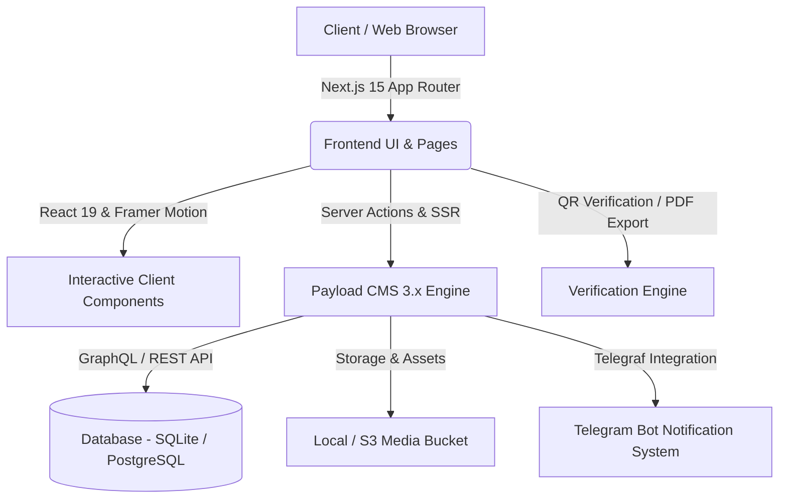

<div align="center">

  

  # ⚡ Coding Club CUH
  
  **An enterprise-grade, student-led digital platform bridging education, events, and community building.**

  <p align="center">
    <a href="https://github.com/itsmeaj27/codingclub/stargazers"></a>
    <a href="https://github.com/itsmeaj27/codingclub/network/members"></a>
    <a href="https://github.com/itsmeaj27/codingclub/issues"></a>
    <a href="https://github.com/itsmeaj27/codingclub/blob/main/LICENSE"></a>
  </p>

  <p align="center">
    
    
    
    
    
    
  </p>

  <p align="center">
    <a href="#-features"><b>Explore Features</b></a> •
    <a href="#-architecture"><b>Architecture</b></a> •
    <a href="#-quick-start"><b>Quick Start</b></a> •
    <a href="#-tech-stack"><b>Tech Stack</b></a> •
    <a href="#-project-structure"><b>Project Structure</b></a> •
    <a href="#-contributing"><b>Contributing</b></a>
  </p>

</div>

---

## 📸 Platform Preview

<div align="center">
  
  <p><sub><i>Central University of Haryana Coding Club — Official Web Hub</i></sub></p>
</div>

---

## ✨ Features

<table>
  <tr>
    <td width="50%">
      <h3>🛡️ Instant Certificate Verification</h3>
      Publicly verify club credentials via custom routes (<code>/verify/:id</code>) with cryptographic QR codes and instant client-side PDF downloads.
    </td>
    <td width="50%">
      <h3>⚡ Headless CMS Power</h3>
      Integrated <b>Payload CMS 3.x</b> with visual Lexical editor, live previews, and automated database sync for courses, posts, and achievements.
    </td>
  </tr>
  <tr>
    <td width="50%">
      <h3>📅 Events & Workshops</h3>
      Showcase upcoming hackathons, tech talks, and bootcamps with attendee registration and status tracking.
    </td>
    <td width="50%">
      <h3>🚀 Student Project Showcase</h3>
      Interactive portfolio showcasing open-source contributions, student achievements, and team hierarchies.
    </td>
  </tr>
  <tr>
    <td width="50%">
      <h3>🤖 Telegram Bot Integration</h3>
      Automated notifications pushing registrations and event announcements directly to club channels.
    </td>
    <td width="50%">
      <h3>🎨 Modern Fluid Aesthetics</h3>
      Seamless Dark/Light mode switching, responsive breakpoints, and smooth micro-interactions powered by Framer Motion & Magic UI.
    </td>
  </tr>
</table>

---

## 🏗️ Architecture



---

## 📁 Project Structure

```bash
codingclub/
├── src/
│   ├── app/
│   │   ├── (app)/                  # Public web application routes
│   │   │   ├── (home)/             # Hero landing page
│   │   │   ├── events/             # Events catalog & registration
│   │   │   ├── posts/              # Articles & announcements
│   │   │   ├── student/            # Student portal
│   │   │   ├── team/               # Core team & contributor directory
│   │   │   └── verify/             # Certificate verification engine
│   │   ├── (payload)/              # Payload CMS Admin panel & endpoints
│   │   └── og-image/               # Dynamic OpenGraph image generator
│   ├── components/                 # Reusable UI & motion components
│   │   ├── magicui/                # Animated UI elements
│   │   ├── motion-primitives/      # Framer motion transitions
│   │   ├── payload/                # CMS rendering blocks
│   │   └── ui/                     # Radix UI primitives
│   ├── lib/                        # Utility functions & global constants
│   ├── payload/                    # CMS collections, hooks, and plugins
│   └── payload.config.ts           # Payload CMS root configuration
├── public/                         # Static assets, branding, and icons
├── next.config.ts                  # Next.js optimization configuration
└── package.json                    # Project dependencies and scripts
```

---

## 🚀 Quick Start

### 📋 Prerequisites

- **Node.js**: `>= 20.0.0`
- **Package Manager**: `pnpm` (recommended), `npm`, or `yarn`

### 🛠️ Step-by-Step Installation

1. **Clone the Repository**
   ```bash
   git clone https://github.com/itsmeaj27/codingclub.git
   cd codingclub
   ```

2. **Install Dependencies**
   ```bash
   pnpm install
   ```

3. **Configure Environment Variables**
   ```bash
   cp .env.example .env
   ```
   *Fill in your local credentials inside `.env`:*

   | Variable | Required | Description | Default / Example |
   | :--- | :---: | :--- | :--- |
   | `DATABASE_URI` | **Yes** | Database connection string | `file:payload.db` |
   | `PAYLOAD_SECRET` | **Yes** | Encryption key for auth & sessions | `your-secure-random-key` |
   | `NEXT_PUBLIC_SERVER_URL` | **Yes** | Root URL for the application | `http://localhost:3001` |
   | `TELEGRAM_BOT_TOKEN` | Optional | Telegram bot token for alerts | `123456:ABC-DEF...` |
   | `TELEGRAM_CHAT_ID` | Optional | Telegram channel/chat target ID | `-100123456789` |

4. **Generate CMS Types & Import Map**
   ```bash
   pnpm run generate
   ```

5. **Launch Development Server**
   ```bash
   pnpm dev
   ```
   Navigate to [http://localhost:3001](http://localhost:3001) in your browser.

> [!TIP]
> Access the **Payload CMS Admin Panel** at [`http://localhost:3001/admin`](http://localhost:3001/admin) to set up the superadmin account and start managing club content.

---

## 🛠️ Tech Stack

<div align="center">

| Area | Technologies |
| :--- | :--- |
| **Core Framework** | Next.js 15 (App Router), React 19, TypeScript 5.7 |
| **Headless CMS** | Payload CMS 3.56 (Lexical Rich Text, Live Preview) |
| **Styling & Design** | Tailwind CSS v4, Radix UI Primitives, Lucide Icons |
| **Animations & FX** | Motion (Framer Motion), Magic UI Primitives |
| **Database & ORM** | SQLite (`@payloadcms/db-sqlite`), PostgreSQL compatible |
| **Integrations** | Telegraf (Telegram Bot), jsPDF, html2canvas, qrcode.react |
| **SEO & Performance** | Next-Sitemap, Dynamic OG Image Generator, Sharp |
| **Quality & Tests** | Playwright, Vitest, ESLint |

</div>

---

## 📜 Available Scripts

| Command | Action |
| :--- | :--- |
| `pnpm dev` | Starts development server on port `3001` |
| `pnpm build` | Compiles application and builds static sitemaps |
| `pnpm start` | Launches production server |
| `pnpm generate` | Regenerates Payload types and admin import maps |
| `pnpm test` | Runs complete test suite (unit + E2E) |
| `pnpm lint` | Analyzes code for issues with ESLint |

---

## 🤝 Contributing

Contributions make the open-source community thrive! Follow these steps to contribute:

```bash
# 1. Fork the repo & create a feature branch
git checkout -b feat/your-feature-name

# 2. Commit your changes with meaningful messages
git commit -m "feat: add awesome new capability"

# 3. Push to your branch
git push origin feat/your-feature-name

# 4. Open a Pull Request on GitHub
```

---

## 📄 License

Distributed under the **MIT License**. See [`LICENSE`](LICENSE) for more information.

<div align="center">
  <sub>Built with 💙 by <b>Coding Club CUH</b> — Central University of Haryana</sub>
</div>
