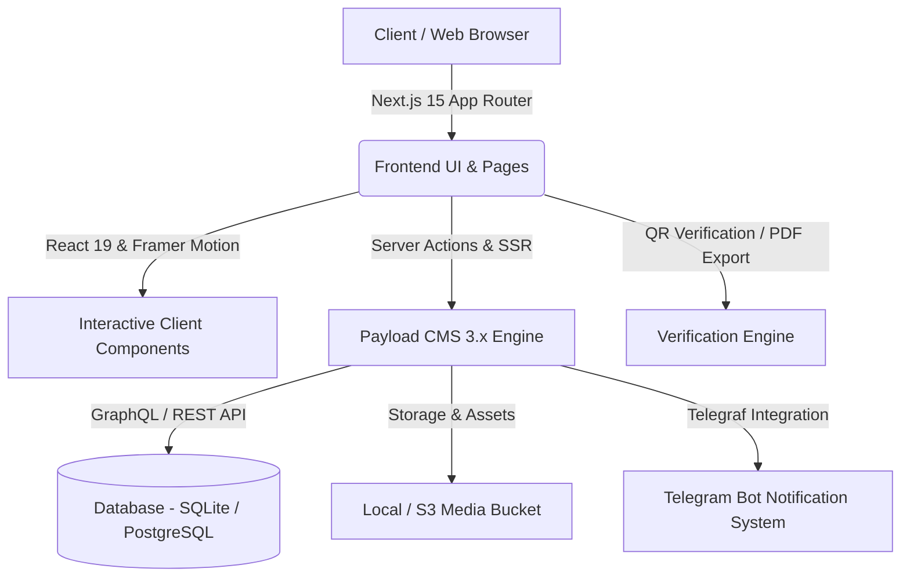

<div align="center">

  

  # ⚡ Coding Club CUH
  
  **An enterprise-grade, student-led digital platform bridging education, events, and community building.**

  <p align="center">
    <a href="https://github.com/itsmeaj27/codingclub/stargazers"></a>
    <a href="https://github.com/itsmeaj27/codingclub/network/members"></a>
    <a href="https://github.com/itsmeaj27/codingclub/issues"></a>
    <a href="https://github.com/itsmeaj27/codingclub/blob/main/LICENSE"></a>
  </p>

  <p align="center">
    
    
    
    
    
    
  </p>

  <p align="center">
    <a href="#-features"><b>Explore Features</b></a> •
    <a href="#-architecture"><b>Architecture</b></a> •
    <a href="#-quick-start"><b>Quick Start</b></a> •
    <a href="#-tech-stack"><b>Tech Stack</b></a> •
    <a href="#-project-structure"><b>Project Structure</b></a> •
    <a href="#-contributing"><b>Contributing</b></a>
  </p>

</div>

---

## 📸 Platform Preview

<div align="center">
  
  <p><sub><i>Central University of Haryana Coding Club — Official Web Hub</i></sub></p>
</div>

---

## ✨ Features

<table>
  <tr>
    <td width="50%">
      <h3>🛡️ Instant Certificate Verification</h3>
      Publicly verify club credentials via custom routes (<code>/verify/:id</code>) with cryptographic QR codes and instant client-side PDF downloads.
    </td>
    <td width="50%">
      <h3>⚡ Headless CMS Power</h3>
      Integrated <b>Payload CMS 3.x</b> with visual Lexical editor, live previews, and automated database sync for courses, posts, and achievements.
    </td>
  </tr>
  <tr>
    <td width="50%">
      <h3>📅 Events & Workshops</h3>
      Showcase upcoming hackathons, tech talks, and bootcamps with attendee registration and status tracking.
    </td>
    <td width="50%">
      <h3>🚀 Student Project Showcase</h3>
      Interactive portfolio showcasing open-source contributions, student achievements, and team hierarchies.
    </td>
  </tr>
  <tr>
    <td width="50%">
      <h3>🤖 Telegram Bot Integration</h3>
      Automated notifications pushing registrations and event announcements directly to club channels.
    </td>
    <td width="50%">
      <h3>🎨 Modern Fluid Aesthetics</h3>
      Seamless Dark/Light mode switching, responsive breakpoints, and smooth micro-interactions powered by Framer Motion & Magic UI.
    </td>
  </tr>
</table>

---

## 🏗️ Architecture



---

## 📁 Full Project Structure

```bash
codingclub/
├── public/                                 # Static assets & public branding
│   ├── ccc_logo.png                        # Primary club logo & favicon assets
│   ├── cuh-logo.png                        # University crest & insignia
│   ├── cuhteam.jpeg                        # Team banner assets
│   ├── contributors/                       # Contributor portraits & media
│   ├── events/                             # Event posters & promotional assets
│   ├── sitemap.xml                         # Auto-generated XML sitemap
│   └── site.webmanifest                    # PWA web manifest
│
├── src/
│   ├── app/                                # Next.js 15 App Router root
│   │   ├── (app)/                          # Frontend user-facing route group
│   │   │   ├── (home)/                     # Hero landing page & showcase
│   │   │   ├── (sitemaps)/                 # Dynamic XML sitemaps generator
│   │   │   │   ├── pages-sitemap.xml/      # Pages sitemap index
│   │   │   │   └── posts-sitemap.xml/      # Posts & articles sitemap
│   │   │   ├── about/                      # About CUH Coding Club
│   │   │   ├── actions/                    # Next.js server actions (e.g. contact form)
│   │   │   ├── auth/                       # Authentication & session routes
│   │   │   │   ├── login/                  # User login page
│   │   │   │   ├── signin/                 # Alternative login handler
│   │   │   │   └── signup/                 # New student registration
│   │   │   ├── certificate/                # Certificate viewer & PDF exporter
│   │   │   │   └── [certificateId]/        # Individual certificate layout & render
│   │   │   ├── contact/                    # Contact form & club support
│   │   │   ├── events/                     # Events catalog & registration
│   │   │   ├── form/                       # Custom dynamic form handlers
│   │   │   ├── next/                       # Next.js preview & seed triggers
│   │   │   │   ├── exit-preview/           # Draft preview exit endpoint
│   │   │   │   ├── preview/                # Payload CMS live preview bridge
│   │   │   │   └── seed/                   # Database seed trigger endpoint
│   │   │   ├── posts/                      # Blog, articles & news
│   │   │   │   ├── page/[pageNumber]/      # Paginated post archive
│   │   │   │   └── [slug]/                 # Single post article reader
│   │   │   ├── search/                     # Global search across collections
│   │   │   ├── student/                    # Student dashboard & profile
│   │   │   ├── team/                       # Team hierarchy & member directory
│   │   │   ├── verify/                     # Certificate verification system
│   │   │   │   └── [certificateId]/        # Instant cryptographic credential check
│   │   │   ├── [slug]/                     # Dynamic page renderer for CMS pages
│   │   │   ├── globals.css                 # Global Tailwind CSS v4 styling rules
│   │   │   └── layout.tsx                  # Root web layout & providers wrapper
│   │   │
│   │   ├── (payload)/                      # Payload CMS backend interface
│   │   │   ├── admin/                      # Embedded Payload Admin dashboard
│   │   │   │   └── [[...segments]]/        # Dynamic admin routing & catch-all
│   │   │   ├── api/                        # Headless API layer
│   │   │   │   ├── graphql/                # GraphQL endpoint
│   │   │   │   ├── graphql-playground/     # Interactive GraphQL playground
│   │   │   │   └── [...slug]/              # Payload REST API endpoints
│   │   │   ├── custom.scss                 # Payload admin panel theme customizations
│   │   │   └── layout.tsx                  # Dedicated admin layout wrapper
│   │   │
│   │   └── og-image/                       # Dynamic OpenGraph image generator
│   │       └── [text]/                     # Dynamic social card route handler
│   │
│   ├── components/                         # Modular component library
│   │   ├── magicui/                        # Animated visual components (Border Beam, etc.)
│   │   ├── motion-primitives/              # Smooth motion utilities (Text effects, infinite sliders)
│   │   ├── payload/                        # Payload CMS block renderers
│   │   │   ├── Card/                       # Post / Event preview cards
│   │   │   ├── CollectionArchive/          # Archive grid & pagination
│   │   │   ├── Link/                       # Dynamic CMS link resolver
│   │   │   ├── LivePreviewListener/        # Hot-reloading live preview listener
│   │   │   ├── Media/                      # Responsive image/video renderer
│   │   │   ├── Pagination/                 # CMS pagination controls
│   │   │   ├── PayloadRedirects/           # Server-side 301/302 redirect engine
│   │   │   └── RichText/                   # Lexical rich text HTML serialiser
│   │   ├── payload-admin/                  # Custom Payload CMS admin UI components
│   │   │   ├── Actions/                    # Admin bar quick actions
│   │   │   ├── AdminBar/                   # Frontend admin bar for logged-in staff
│   │   │   ├── BeforeDashboard/            # Custom dashboard welcome card
│   │   │   ├── BeforeLogin/                # Custom login screen disclaimer
│   │   │   └── GraphicsIcon/ & GraphicsLogo/ # Custom admin branding logos
│   │   ├── ui/                             # Accessible Radix UI primitives & components
│   │   │   ├── accordion.tsx               # Collapsible accordion element
│   │   │   ├── avatar.tsx                  # User & contributor avatar
│   │   │   ├── button.tsx                  # Interactive button states
│   │   │   ├── card.tsx                    # Surface card wrapper
│   │   │   ├── carousel.tsx                # Embla carousel wrapper
│   │   │   ├── dropdown-menu.tsx           # Context & dropdown menus
│   │   │   ├── sonner.tsx                  # Modern toast notification engine
│   │   │   └── timeline.tsx                # Event / history timeline component
│   │   ├── navbar.tsx                      # Navigation bar with theme toggle
│   │   ├── footer.tsx                      # Global footer with university links
│   │   └── theme-provider.tsx              # NextThemes dark/light provider
│   │
│   ├── payload/                            # Payload CMS architecture & schemas
│   │   ├── access/                         # Access control policies (RBAC)
│   │   ├── blocks/                         # Modular layout blocks (CTA, Banner, Code, Form)
│   │   ├── collections/                    # Content collections & schemas
│   │   │   ├── Achievements.ts             # Student awards & recognitions
│   │   │   ├── Categories.ts               # Content categorization taxonomy
│   │   │   ├── Certificates.ts             # Issued certificates & verification data
│   │   │   ├── Courses/                    # Structured learning roadmaps & modules
│   │   │   ├── Events.ts                   # Hackathons, bootcamps & workshop records
│   │   │   ├── Gallery.ts                  # Event photos & activity media
│   │   │   ├── Media.ts                    # S3 / Local media storage collection
│   │   │   ├── Pages/                      # Dynamic CMS landing pages
│   │   │   ├── Posts/                      # Blog posts, articles & updates
│   │   │   ├── Projects.ts                 # Student showcase repositories
│   │   │   ├── Teams.ts                    # Core team, mentors & council members
│   │   │   └── Users/                      # Club members & admin accounts
│   │   ├── fields/                         # Reusable Lexical fields & slug formatters
│   │   ├── Header/ & Footer/               # Global navigation & footer CMS schemas
│   │   ├── heros/                          # Hero banner components (High/Medium/Low impact)
│   │   ├── hooks/                          # Revalidation & data normalization hooks
│   │   ├── plugins/                        # Payload plugins (SEO, Search, Form builder, etc.)
│   │   ├── providers/                      # Header & admin theme contexts
│   │   └── utilities/                      # CMS helpers (formatDate, getURL, deepMerge)
│   │
│   ├── lib/                                # Core utility functions & constants
│   │   ├── constants.ts                    # Global navigation items & site metadata
│   │   └── utils.ts                        # Tailwind class merge (clsx + twMerge)
│   │
│   ├── payload-types.ts                    # Auto-generated TypeScript types from schemas
│   └── payload.config.ts                   # Root Payload CMS configuration
│
├── .env.example                            # Template environment variables
├── components.json                         # Shadcn/Radix UI CLI configuration
├── eslint.config.mjs                       # ESLint 9 configuration
├── next-sitemap.config.cjs                 # Dynamic sitemap generator settings
├── next.config.ts                          # Next.js 15 configuration & image domains
├── package.json                            # Package dependencies and execution scripts
├── pnpm-lock.yaml                          # Pnpm lockfile
├── postcss.config.mjs                      # PostCSS & Tailwind v4 config
└── tsconfig.json                           # TypeScript compiler configuration
```

---

## 🚀 Quick Start

### 📋 Prerequisites

- **Node.js**: `>= 20.0.0`
- **Package Manager**: `pnpm` (recommended), `npm`, or `yarn`

### 🛠️ Step-by-Step Installation

1. **Clone the Repository**
   ```bash
   git clone https://github.com/itsmeaj27/codingclub.git
   cd codingclub
   ```

2. **Install Dependencies**
   ```bash
   pnpm install
   ```

3. **Configure Environment Variables**
   ```bash
   cp .env.example .env
   ```
   *Fill in your local credentials inside `.env`:*

   | Variable | Required | Description | Default / Example |
   | :--- | :---: | :--- | :--- |
   | `DATABASE_URI` | **Yes** | Database connection string | `file:payload.db` |
   | `PAYLOAD_SECRET` | **Yes** | Encryption key for auth & sessions | `your-secure-random-key` |
   | `NEXT_PUBLIC_SERVER_URL` | **Yes** | Root URL for the application | `http://localhost:3001` |
   | `TELEGRAM_BOT_TOKEN` | Optional | Telegram bot token for alerts | `123456:ABC-DEF...` |
   | `TELEGRAM_CHAT_ID` | Optional | Telegram channel/chat target ID | `-100123456789` |

4. **Generate CMS Types & Import Map**
   ```bash
   pnpm run generate
   ```

5. **Launch Development Server**
   ```bash
   pnpm dev
   ```
   Navigate to [http://localhost:3001](http://localhost:3001) in your browser.

> [!TIP]
> Access the **Payload CMS Admin Panel** at [`http://localhost:3001/admin`](http://localhost:3001/admin) to set up the superadmin account and start managing club content.

---

## 🛠️ Tech Stack

<div align="center">

| Area | Technologies |
| :--- | :--- |
| **Core Framework** | Next.js 15 (App Router), React 19, TypeScript 5.7 |
| **Headless CMS** | Payload CMS 3.56 (Lexical Rich Text, Live Preview) |
| **Styling & Design** | Tailwind CSS v4, Radix UI Primitives, Lucide Icons |
| **Animations & FX** | Motion (Framer Motion), Magic UI Primitives |
| **Database & ORM** | SQLite (`@payloadcms/db-sqlite`), PostgreSQL compatible |
| **Integrations** | Telegraf (Telegram Bot), jsPDF, html2canvas, qrcode.react |
| **SEO & Performance** | Next-Sitemap, Dynamic OG Image Generator, Sharp |
| **Quality & Tests** | Playwright, Vitest, ESLint |

</div>

---

## 📜 Available Scripts

| Command | Action |
| :--- | :--- |
| `pnpm dev` | Starts development server on port `3001` |
| `pnpm build` | Compiles application and builds static sitemaps |
| `pnpm start` | Launches production server |
| `pnpm generate` | Regenerates Payload types and admin import maps |
| `pnpm test` | Runs complete test suite (unit + E2E) |
| `pnpm lint` | Analyzes code for issues with ESLint |

---

## 🤝 Contributing

Contributions make the open-source community thrive! Follow these steps to contribute:

```bash
# 1. Fork the repo & create a feature branch
git checkout -b feat/your-feature-name

# 2. Commit your changes with meaningful messages
git commit -m "feat: add awesome new capability"

# 3. Push to your branch
git push origin feat/your-feature-name

# 4. Open a Pull Request on GitHub
```

---

## 📄 License & Usage Terms

This project is protected under a **Restricted Academic & Institutional License**.

> [!CAUTION]
> **Restricted Authorization**: This codebase, platform, and associated materials are strictly proprietary and reserved exclusively for enrolled students and faculty members of the **Computer Science (CS)** and **Information Technology (IT)** departments at the **Central University of Haryana (CUH)**. Unauthorized usage, distribution, hosting, or reproduction by any external entity is strictly prohibited.

For complete terms and legal details, please consult the [`LICENSE`](LICENSE) file.

<div align="center">
  <sub>Built with 💙 by <b>Coding Club CUH</b> — Central University of Haryana</sub>
</div>
